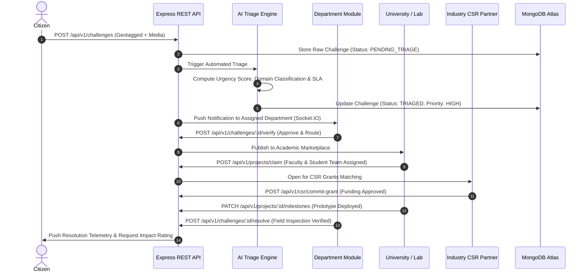

# ⚙️ JoharSetu — Backend Architecture & Technical Documentation
**Smart India Hackathon (SIH 2026) Flagship Initiative**  
*Robust, Scalable, Domain-Driven Monolith for State-Wide Civic Innovation & Governance*

---

## 📌 1. Executive Summary & Core Mission

The **JoharSetu Backend** is an enterprise-grade RESTful API service engineered to power Jharkhand's societal innovation and problem-solving infrastructure. It coordinates data flows between **4 Government administrative tiers**, **Higher Education Institutions (HEIs)**, **Corporate CSR Investors**, and **Citizens**.

### 🎯 Key Engineering Goals for SIH 2026:
- **Zero Data Inconsistency**: Single source of truth for all users via unified authentication reconciliation.
- **Strong Cryptographic Security**: Strict Bcrypt (10 rounds) password hashing across all automated and manual registrations.
- **High-Throughput Concurrency**: Asynchronous I/O capable of handling simultaneous grievance bursts across 24 districts.
- **Decoupled Modular Architecture**: Clean separation between Controllers, Services, and Repositories.

---

## 💻 2. Technology Stack & Architectural Decision Records (ADR)

| Layer / Concern | Technology | Rationale & Implementation Details |
| :--- | :--- | :--- |
| **Runtime & Framework** | **Node.js (v20+)** + **Express.js** | Non-blocking, event-driven I/O ideal for real-time updates and scalable micro-services. |
| **Database & ODM** | **MongoDB Atlas** + **Mongoose 8** | Flexible JSON-document model perfectly matching evolving civic challenge schemas, spatial GeoJSON indexes, and audit logs. |
| **Authentication** | **JWT (JSON Web Tokens)** + **Bcrypt.js** | Stateless Bearer authentication. 15-minute Access Tokens paired with 7-day Refresh Token rotation in MongoDB. |
| **Real-Time Layer** | **Socket.IO** | Bi-directional WebSocket channels broadcasting real-time AI triage status changes and emergency alerts. |
| **File Storage** | **Multer (Local / Cloud Ready)** | Multipart form parser with strict MIME-type and size validation (Max 10MB) for problem media and PDF proposals. |
| **Notifications** | **Nodemailer SMTP** | Automated transactional emails delivering 6-digit cryptographic OTPs for email verification and password reset. |
| **Security & Hardening** | **Helmet**, **CORS**, **Rate-Limit** | Request sanitization, brute-force IP rate limiting (100 req/15min on auth), and NoSQL injection protection. |

---

## 🏛️ 3. Multi-Tier Department Management Architecture

JoharSetu establishes an authoritative 4-tier governance hierarchy designed to model Jharkhand's actual administrative structure.

```
                  ┌─────────────────────────────────────────┐
                  │          STATE MINISTRIES (Tier 1)      │
                  │  (e.g., Dept of Higher & Technical Edu) │
                  └────────────────────┬────────────────────┘
                                       │
                  ┌────────────────────▼────────────────────┐
                  │       DISTRICT DEPARTMENTS (Tier 2)     │
                  │   (e.g., DRDA Ranchi, DTO Dhanbad)      │
                  └────────────────────┬────────────────────┘
                                       │
                  ┌────────────────────▼────────────────────┐
                  │       BLOCK / TEHSIL OFFICES (Tier 3)   │
                  │   (e.g., Block Development Office Kanke)│
                  └────────────────────┬────────────────────┘
                                       │
                  ┌────────────────────▼────────────────────┐
                  │   GRAM PANCHAYAT / WARDS (Tier 4)       │
                  │ (Grassroots Verification & Local Bodies)│
                  └─────────────────────────────────────────┘
```

### Department Data Schema (`department.schema.js`)
```javascript
{
  deptId: { type: String, required: true, unique: true, index: true }, // e.g., 'DEPT-JH-STATE'
  name: { type: String, required: true, index: true },
  code: { type: String, required: true, uppercase: true },
  category: {
    type: String,
    enum: ['State Ministry', 'District Department', 'Block / Tehsil Office', 'Gram Panchayat', 'Ward Commissioner'],
    required: true,
    index: true
  },
  district: { type: String, required: true },
  headName: { type: String, required: true },
  headEmail: { type: String, required: true },
  credentials: {
    loginEmail: { type: String, required: true },
    passwordHash: { type: String, default: null } // Bcrypt Hash
  },
  activeProjects: { type: Number, default: 0 },
  status: { type: String, enum: ['Active', 'Suspended', 'Archived'], default: 'Active' },
  auditLogs: [ ... ]
}
```

### Department Authentication & Account Synchronization:
1. **Creation/Update**: Whenever a department is registered or its password updated in `department.service.js`, the password is automatically encrypted using `bcrypt.hash(password, 10)`.
2. **Unified User Sync**: The service upserts a corresponding record in the central `MongooseUser` collection with `role: 'DEPARTMENT'`, `accountStatus: 'ACTIVE'`, and `emailVerification: { verified: true }`.
3. **Dual-Identifier Login**: Department personnel can authenticate via either their **Official Login Email** (`waterdepartment@gmail.com`) OR their **System Department ID** (`DEPT-JH-STATE`).

---

## 🔄 4. End-to-End Problem Statement Lifecycle (SIH Pipeline)



---

## 📁 5. Backend Folder Structure & Architecture

```
BACKEND/
├── server.js                   # Application entrypoint
├── src/
│   ├── app.js                  # Express app setup, middlewares, rate-limiting
│   ├── config/                 # Environment variables, database connection
│   │
│   ├── modules/                # Domain-Driven Modules
│   │   ├── auth/               # JWT authentication, Login, Register, OTP services
│   │   │   ├── application/    # login.service.js, token.service.js, department-auth.helper.js
│   │   │   ├── controllers/    # auth.controller.js
│   │   │   └── infrastructure/ # repository.js (Token blacklist & refresh tokens)
│   │   │
│   │   ├── users/              # Core user domain & multi-identifier resolver
│   │   │   ├── infrastructure/ # model.js (Single collection 'users'), repository.js
│   │   │   └── application/    # service.js
│   │   │
│   │   ├── government/         # State Administration & Multi-Tier Governance
│   │   │   ├── departments/    # department.schema.js, department.service.js, controller
│   │   │   ├── heis/           # University onboarding, accreditation, capacity metrics
│   │   │   ├── industries/     # Corporate registration, CSR funding tracker
│   │   │   ├── admins/         # Nodal & administrative profile management
│   │   │   └── triage/         # AI Triage prioritization & SLA engine
│   │   │
│   │   ├── citizen/            # Citizen challenge intake & status tracking
│   │   ├── projects/           # Collaborative R&D solutions & milestones
│   │   ├── csr/                # Industry grant lifecycle management
│   │   └── notices/            # Government directives & public announcements
│   │
│   ├── middleware/             # Auth guards, RBAC, error handlers, rate-limiters
│   └── utils/                  # Logger, response envelope, cryptographic helpers
```

---

## 🛡️ 6. Security, Resilience & Scalability Measures

1. **Role-Based Access Control (RBAC)**:
   Routes are guarded by strict role matrices (`authenticateToken`, `authorizeRoles('GOVERNMENT', 'ADMIN', 'DEPARTMENT')`).
2. **Password Security**:
   Universal bcrypt hashing with 10 salt rounds. Plaintext passwords are never persisted to the database.
3. **NoSQL Injection & Parameter Tampering Prevention**:
   Input validation sanitizes MongoDB query operators (`$gt`, `$ne`, `$regex`) preventing injection exploits.
4. **Resilient User Reconciliation**:
   The `repository.js` engine dynamically reconciles institutional entities (`University`, `Industry`, `Department`) with `MongooseUser`, automatically preventing duplicate phone number index collisions (`mobileNumber_1 dup key`).
5. **Rate Limiting**:
   Brute-force protection limits API authentication endpoints to 100 requests per 15-minute window per IP.

---

## 📡 7. Core API Endpoint Reference

### Authentication (`/api/v1/auth`)
- `POST /register`: Multi-role onboarding (Citizen, University, Industry) with OTP dispatch.
- `POST /login`: Universal login by Email, Username, DeptID, University Code, or Industry ID.
- `POST /refresh-token`: Silent access token renewal.
- `GET /me`: Authenticated user profile and permissions envelope.
- `POST /verify-email`: 6-digit OTP verification.

### Government & Department Governance (`/api/v1/government`)
- `GET /overview/metrics`: State-wide KPIs (Active challenges, HEI capacity, CSR committed).
- `GET /departments`: Hierarchical list of all 4 department tiers.
- `POST /departments`: Onboard new Department with auto-generated ID and bcrypt credentials.
- `PUT /departments/:id`: Update department details or reset password with automatic user sync.
- `GET /triage/feed`: AI-prioritized real-time civic challenge feed.
