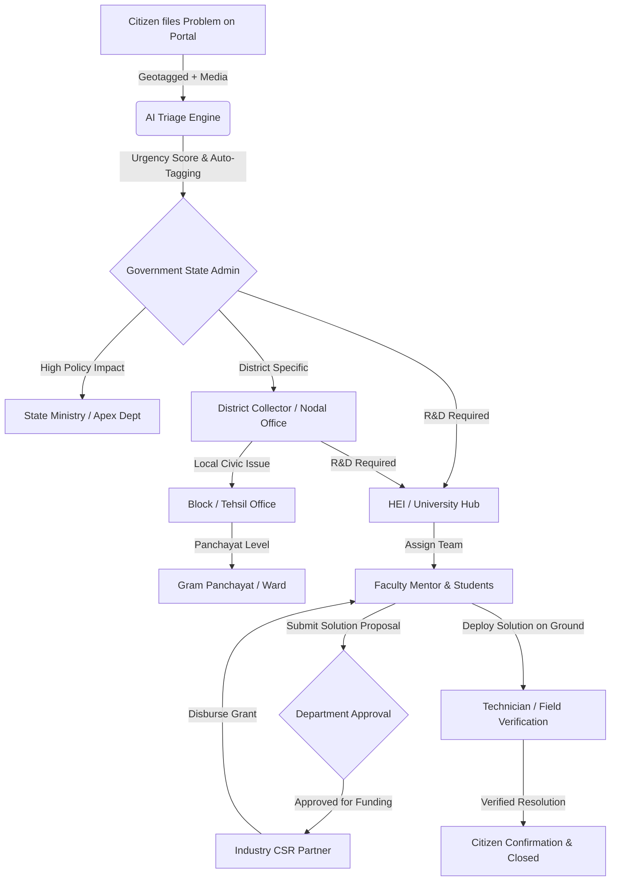

# 🏛️ JoharSetu — Frontend Architecture & Technical Documentation
**Smart India Hackathon (SIH 2026) Flagship Initiative**  
*Connecting Community Challenges with Academic Solvers, Industry Funding & Government Departments*

---

## 📌 1. Executive Summary & SIH 2026 Vision

**JoharSetu** (*People • Ideas • Innovation • A Stronger Jharkhand*) is a state-grade digital public infrastructure (DPI) platform engineered for **Smart India Hackathon 2026**. 

### 🎯 The Core Problem Solved:
1. **Disconnected Ecosystems**: Citizens face grassroots civic, infrastructural, water, and agricultural challenges without a structured mechanism to reach academic research or administrative solutions.
2. **Untapped Academic Potential**: Universities and Higher Education Institutions (HEIs) have skilled faculty and engineering students, but lack access to real-world, localized problem statements.
3. **Underutilized CSR & Industry Capital**: Corporate enterprises and industries wish to invest CSR funds in sustainable local development but lack verified, vetted impact projects.
4. **Administrative Bottlenecks**: Government departments are overwhelmed with unorganized grievances without automated priority scoring, geospatial clustering, or multi-tier departmental delegation.

### 💡 The JoharSetu Solution:
A unified, real-time platform that **ingests citizen challenges**, runs automated **AI Triage & Urgency Scoring**, routes them through a **4-tier Government Department Hierarchy**, matches them with **University R&D Labs**, and secures **Industry CSR Funding & Mentorship** for on-ground deployment.

---

## 💻 2. Technology Stack & Technical Approach

| Domain | Technology | Rationale & Architectural Choice |
| :--- | :--- | :--- |
| **Framework** | **React 19** + **Vite 6** | Modern functional architecture with high performance, instant HMR, optimized bundle chunking, and concurrent rendering. |
| **Styling & Design System** | **TailwindCSS v4** (Vanilla CSS Variables) | Ultra-fast build times, zero runtime CSS overhead, strict color token consistency, and clean typography. |
| **Color System** | **JoharSetu Green Theme** (`#007A61`) | Official Jharkhand Government aesthetic: Forest Deep Green (`#007A61`), Emerald Accent (`#005C48`), Slate (`#0f172a`), Crisp Off-White (`#f8fafc`). |
| **Micro-Interactions** | **Framer Motion** | Smooth layout animations, page transitions, accordion unfolding, and dashboard stat ticker animations without layout shift. |
| **Spatial & GIS Engine** | **Leaflet & Leaflet-Heat** | Open-source, zero-cost, high-performance interactive maps for all 24 districts of Jharkhand with heatmap clustering and problem pins. |
| **Iconography** | **Lucide React** | Consistent, tree-shakable SVG icons matching enterprise design principles. |
| **State & Session Management** | **React Context API** (`AuthContext`) | Centralized authentication, silent token refresh, automatic role-based redirection, and persistent sessions via localStorage. |
| **API Client** | **Native Fetch with Interceptors** | Clean request wrapper with automatic JWT Bearer injection, 401 token refresh interception, and centralized error parsing. |
| **PDF & Dossier Export** | **HTML2Canvas & Custom CSS Print** | Generates official Government-branded PDF dossiers, printable reports, and institutional directory cards directly from the browser. |

---

## 🏗️ 3. Frontend Architecture & Folder Structure

JoharSetu follows a **Modular, Feature-Driven Architecture (Domain-Driven Design)** ensuring each civic domain is isolated, maintainable, and independently testable.

```
FRONTEND/
├── public/                     # Static assets, favicons, government emblems
├── src/
│   ├── app/                    # Application Root, Providers & Routing
│   │   ├── App.jsx             # Top-level application shell with QueryClient
│   │   ├── layout.jsx          # Full-height RootLayout with responsive docking
│   │   ├── router.jsx          # Declarative client-side router with query sync
│   │   └── ProtectedRoute.jsx  # Role-Based Access Control (RBAC) route guard
│   │
│   ├── features/               # Modular Domain Features
│   │   ├── auth/               # Multi-step onboarding, Login, OTP verification
│   │   │   ├── components/     # LoginForm, RegisterForm, IndustryRegistrationPage
│   │   │   └── AuthContext.jsx # Global session & auth provider
│   │   │
│   │   ├── citizen/            # Citizen Grievance & Challenge Portal
│   │   │   ├── components/     # CitizenHome, SubmitModal, MyChallenges, Profile
│   │   │   ├── services/       # citizenService.js (HTTP API layer)
│   │   │   └── CitizenPortal.jsx
│   │   │
│   │   ├── government/         # Apex State & Governance Command Center
│   │   │   ├── components/
│   │   │   │   ├── overview/   # PriorityAiTriageFeed, RealTimeKpiRibbon
│   │   │   │   ├── triage/     # AITriageDashboard, UrgencyClassifier
│   │   │   │   ├── heis/       # HeiHubPanel, ManageUniversitiesDashboard
│   │   │   │   ├── industries/ # ManageIndustriesDashboard, CSRCommitments
│   │   │   │   ├── governance/ # DepartmentsManagementPanel (State/District/Block/Ward)
│   │   │   │   ├── gis/        # GovernmentGisDashboard, Leaflet Heatmap
│   │   │   │   └── layout/     # GovernmentHeader, Sidebar, Footer
│   │   │   └── GovernmentLayout.jsx
│   │   │
│   │   ├── university/         # Higher Education Institution (HEI) Portal
│   │   │   ├── components/     # UniversityLayout, LabFacilities, ActiveProjects
│   │   │   └── services/       # universityService.js
│   │   │
│   │   ├── faculty/            # Faculty Mentorship & Student Lab Matching
│   │   ├── industry/           # Industry CSR & Innovation Investment Portal
│   │   ├── nodal/              # District Nodal Officer Triage Portal
│   │   ├── department/         # Departmental Field Execution Portal
│   │   ├── block/ & ward/      # Local Body (Tehsil & Gram Panchayat) Portals
│   │   ├── technician/         # On-ground Field Telemetry & Verification
│   │   │
│   │   └── landing/            # Public-Facing Digital Showcase
│   │       ├── components/     # HeroCarousel, InteractiveDistrictMap, SectorCards
│   │       └── layout/         # LandingHeader, LandingFooter, LandingLayout
│   │
│   ├── shared/                 # Reusable Atomic UI Component Library
│   │   └── components/ui/      # Button, Card, Badge, Modal, Alert, PortalSkeleton
│   │
│   ├── services/               # Shared HTTP Clients & PDF Generators
│   │   ├── client.js           # Base HTTP client with auto-JWT & retry logic
│   │   └── exportPdfService.js # High-resolution official printable dossiers
│   │
│   └── index.css               # Design tokens, custom scrollbars, print rules
```

---

## 🛡️ 4. Role-Based Portals & Key Features (SIH Perspective)

### 1. 📢 Public Landing & Transparency Experience (`/`)
- **Interactive 24-District Map Modal**: Citizens can click on any Jharkhand district (Ranchi, Dhanbad, East Singhbhum, etc.) to view active local challenges, university nodes, and live resolution rates.
- **Dynamic Notice Board**: Live marquee ticker fetching high-priority government directives and innovation hackathon calls.
- **Multilingual Support**: Header toggle for Hindi and English accessibility.

### 2. 👤 Citizen Portal (`/citizen`)
- **Geotagged Problem Filing**: Submit challenges with GPS location, photo evidence, category tag (Water, Health, Agriculture, Road), and priority indicator.
- **Real-Time Lifecycle Tracking**: Live visual stepper tracking status:  
  `Submitted ➔ AI Triaged ➔ Department Verified ➔ HEI Assigned ➔ In R&D ➔ Resolved`.
- **Public Innovation Directive Guidelines**: Clear accordion explaining community submission criteria.

### 3. 🏛️ Government Apex Command Center (`/government`)
- **Priority AI Triage Engine**: Automated urgency calculation (High/Medium/Low) based on severity, population affected, and infrastructure risk.
- **GIS Spatial Dashboard**: Live Leaflet heatmap identifying regional challenge clusters and disaster-prone zones.
- **Multi-Tier Department Governance**: Complete CRUD for State Ministries, District Depts, Block Offices, and Ward Commissioners.
- **Direct PDF Dossier Generation**: Export one-click executive summaries for cabinet meetings and district collector reviews.

### 4. 🎓 University & HEI Hub (`/university`)
- **Problem Statement Marketplace**: Verified challenges available for academic claims by Engineering/Science faculties.
- **Faculty Mentorship Allocation**: Assign lead professors, student research teams, and lab facilities to solve community problems.
- **Prototype Milestone Telemetry**: Submit R&D milestones (Design, Simulation, Prototype, Field Testing).

### 5. 🏭 Industry & CSR Innovation Portal (`/industry-portal`)
- **CSR Grants Management**: Corporate entities (e.g., Tata Steel, CCL, SAIL) commit funding directly to verified civic solutions.
- **Technology Commercialization**: Evaluate university prototypes and sponsor pilot deployments across Jharkhand villages.

---

## 🔄 5. Multi-Tier Department Flowchart (SIH Workflow)



### Department Levels & Roles:
1. **State Ministry**: Apex state policymaking (e.g., Department of Higher & Technical Education, Drinking Water & Sanitation).
2. **District Department**: District-level administration supervised by the District Nodal Lead.
3. **Block / Tehsil Office**: Sub-district administrative unit monitoring field logistics.
4. **Gram Panchayat / Ward Commissioner**: Grassroots hyper-local authority verifying ground truth.

---

## ⚡ 6. Performance & Production Standards

- **Zero Layout Shifts (CLS < 0.05)**: Skeleton loaders for all async dashboard feeds.
- **Instant Role-Aware Navigation**: Query string sanitization prevents broken URL states.
- **Docked Viewport Layout**: Dashboards use strict `h-screen overflow-hidden` with scrollable inner viewports, eliminating white space voids.
- **Production Bundle Verified**: Clean Vite build with zero circular dependencies or unresolved imports.
