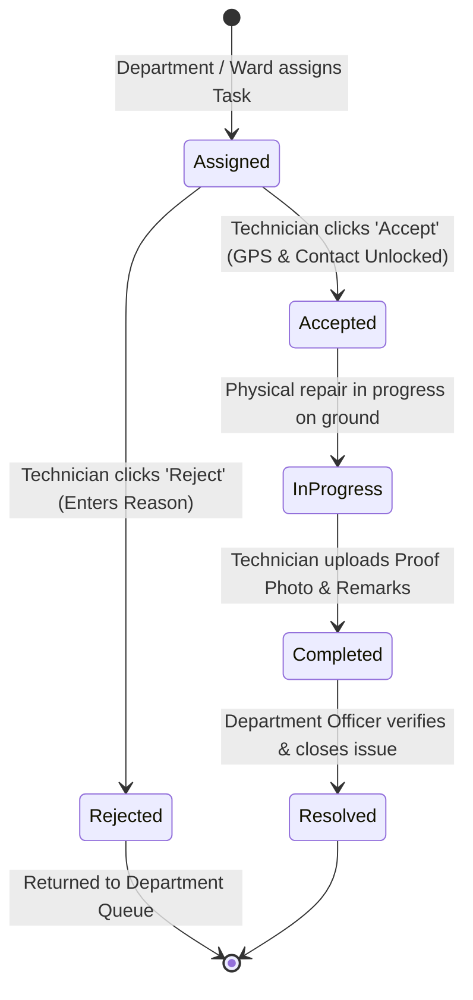

# Module 15: On-Ground Field Technician Portal

> **Module Path:** `src/features/technician/`  
> **Type:** Mobile-First Field Workforce Execution & Resolution Workflow  
> **Key Technologies:** Mobile-First Responsive Layout, Geolocation Coordinates Unlocking, Photo Upload, Count Memoization

---

## 1. Module Ka Purpose (Kyu aur Kya Kaam Hai)

Ye module on-ground technical staff (electricians, junior engineers, municipal line workers, pump operators, sanitization supervisors) ke liye lightweight, mobile-first task execution application hai. Iska primary kaam technicians ko unke mobile phone par unko assign kiye gaye tasks dikhana, task accept karne par citizen ke exact contact details aur GPS location unlock karna, problem spot par repair work execute karna, aur completion proof (photo + remarks) upload karke task submit karna hai.

---

## 2. Directory Structure & Files

```
src/features/technician/
├── index.js                                   # Barrel export
├── TechnicianPortal.jsx                       # Master Technician execution portal
├── TechnicianHeader.jsx                       # Header with fast refresh trigger & user badge
├── TechnicianSidebar.jsx                      # Desktop navigation sidebar with status counts
├── TechnicianMobileNav.jsx                    # Mobile fixed bottom tab navigation
├── TechnicianOverview.jsx                     # Technician home metrics & active task snapshot
├── TechnicianProblemsList.jsx                 # Full listing of assigned field tasks
├── TechnicianProfileTab.jsx                   # Technician identity & performance stats
├── TechnicianProblemDetailModal.jsx           # Task inspection & coordinates viewer
├── TechnicianProblemRow.jsx                   # High-density task row item
├── TechnicianTaskCard.jsx                     # Touch-friendly task execution card
├── TechnicianToolbar.jsx                      # Fast filters & search toolbar
├── CompleteTaskModal.jsx                      # Task resolution submission modal with photo proof
└── RejectTaskModal.jsx                        # Task rejection modal with mandatory reason
```

---

## 3. Core Operational Workflows & Task Lifecycle

### 3.1 Task Lifecycle Management



### 3.2 Secure Geolocation & Contact Unlocking
- Jab tak technician task accept nahi karta, citizen ka personal mobile number aur exact landmark masked rehte hain (privacy preservation).
- Jaise hi technician "Accept Problem" par click karta hai (`handleAcceptTask`):
  - Task state `Accepted` mark ho jati hai.
  - Citizen ke exact GPS Telemetry coordinates aur direct call trigger button screen par unlock ho jate hain.
  - Citizen ko automated SMS/Notification chala jata hai ki technician on the way hai.

### 3.3 Task Rejection (`RejectTaskModal.jsx`)
- Agar problem out of scope hai, materials unavailable hain, ya galat department ko assign ho gayi hai:
  - Technician "Reject Task" par click karta hai.
  - Reason capture hota hai (e.g. "Specialized 3-phase replacement parts required").
  - Status `Not Solved` mark hokar turant Ward Commissioner / Department Executive Engineer ke inbox me wapas chala jata hai.

### 3.4 Task Completion & Photo Proof (`CompleteTaskModal.jsx`)
- Repair work khatam hone par technician:
  - Site par repair ke baad ki photo click karke attach karta hai (`attachmentStr`).
  - Detailed resolution remarks likhta hai (e.g. "Replaced 200m damaged PVC line and restored pressure").
  - API call: `PATCH citizen/challenges/:id/triage` with `status: 'In Progress'` and `assignedTechnician.status: 'Completed'`.
  - Issue verify hone ke liye Department Supervisor ke paas chala jata hai.
