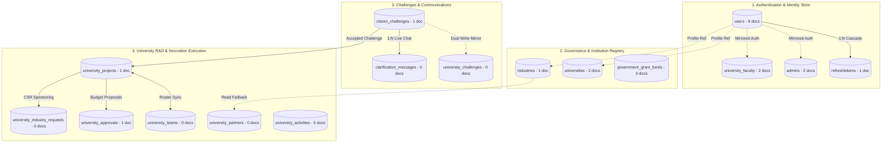
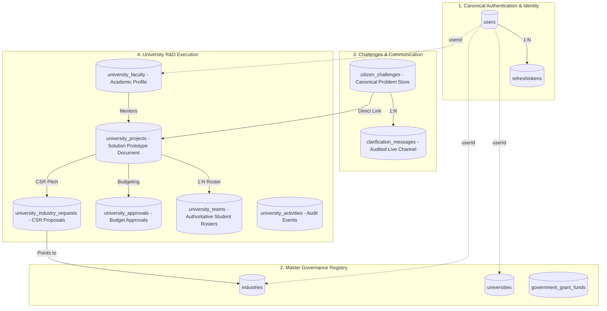
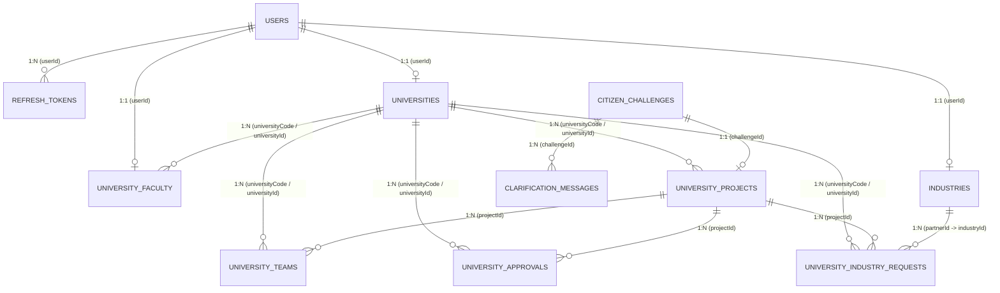
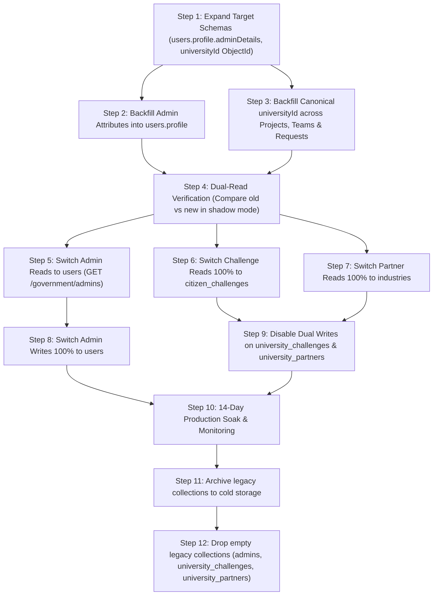

# JoharSetu — Phase 3 Database Migration Design & Architecture Specification

**Document**: `PHASE_3_MIGRATION_DESIGN.md`  
**Author**: Senior Staff Backend Engineer & Database Architect  
**Status**: DESIGN & READINESS ASSESSMENT ONLY (No data modified, no collections dropped, no migrations executed)  
**Target Execution**: Subject to Explicit Technical Review and Sign-off  

---

## 1. Current Architecture (Post-Phase 2 Baseline)

The current system operates on 16 distinct MongoDB collections across 4 business domains:



### Architectural Flaws in Current State
1. **Auth Identity Duplication**: Authentication identity (passwords, status, email, mobile) is mirrored between `users`, `admins`, and `university_faculty`.
2. **Shadow Challenge Projection**: `university_challenges` is maintained via dual-writes, but holds 0 documents on Atlas while `citizen_challenges` is the true canonical source.
3. **Redundant Partner Entity**: `university_partners` holds 0 documents; the code reads directly from `industries`.
4. **Identifier Triplication**: University tenant queries mix internal codes (`RU001`), AISHE codes (`U-0205`), and MongoDB ObjectIds (`_id`).

---

## 2. Target Architecture (Canonical 11-Collection Model)

The target architecture enforces **One Source of Truth Per Business Entity** while preserving 100% of academic, historical, and government audit information:



### Core Architectural Guarantees
- **`users`** is the **sole** authentication entity in the platform. No other collection stores `passwordHash`, credentials, or auth status.
- **`admins`** is retired; administrative and nodal officer metadata lives inside `users.profile.adminDetails` (or an `admin_profiles` projection if strict separation is preferred).
- **`citizen_challenges`** is the single canonical source for problems. `university_challenges` is safely retired.
- **`industries`** is the single canonical corporate entity. `university_partners` is retired; partnerships are represented via `university_industry_requests`.
- **`university_teams`** is the authoritative store for student teams. `project.teamMembers` is retained as a read-only compatibility view.

---

## 3. Collection-by-Collection Migration Matrix

| # | Current Collection | Target Disposition | Target Collection | Primary Key / Ref Key | Data Loss Risk |
|---|---|---|---|---|:---:|
| 1 | `users` | **Retain & Expand** | `users` | `_id` | **Zero** |
| 2 | `refreshtokens` | **Retain** | `refreshtokens` | `_id` (ref `users._id`) | **Zero** |
| 3 | `admins` | **Migrate & Retire** | `users.profile.adminDetails` | `userId` (ObjectId) | **Zero** (1:1 users exist) |
| 4 | `universities` | **Retain** | `universities` | `_id`, `code` | **Zero** |
| 5 | `industries` | **Retain** | `industries` | `_id`, `industryId` | **Zero** |
| 6 | `citizen_challenges` | **Retain & Authoritative** | `citizen_challenges` | `challengeId` | **Zero** |
| 7 | `university_challenges` | **Retire** (0 docs) | `citizen_challenges` | `challengeId` | **Zero** |
| 8 | `university_projects` | **Retain** | `university_projects` | `projectId` | **Zero** |
| 9 | `university_faculty` | **Retain as Academic Profile** | `university_faculty` | `_id` (ref `users.userId`) | **Zero** (Credentials removed) |
| 10 | `university_teams` | **Retain & Authoritative** | `university_teams` | `teamCode` (ref `projectId`) | **Zero** |
| 11 | `university_partners` | **Retire** (0 docs) | `industries` | `industryId` | **Zero** |
| 12 | `university_approvals` | **Retain** | `university_approvals` | `approvalId` (ref `projectId`) | **Zero** |
| 13 | `university_activities` | **Retain** | `university_activities` | `_id` | **Zero** |
| 14 | `university_industry_requests`| **Retain** | `university_industry_requests` | `requestId` (ref `partnerId`) | **Zero** |
| 15 | `clarification_messages` | **Retain** | `clarification_messages` | `_id` (ref `challengeId`) | **Zero** |
| 16 | `government_grant_funds` | **Retain** | `government_grant_funds` | `fundId` | **Zero** |

---

## 4. Field Mapping Specification

### 4.1 `admins` ➔ `users.profile.adminDetails`

Live scan confirmed both existing admins in Atlas already have matching `User` documents.

```
Source: admins                          Target: users
------------------------------------    --------------------------------------------------
_id                                 ➔   (Historical reference logged in profile.legacyAdminId)
fullName                            ➔   users.fullName
username                            ➔   users.profile.username
email                               ➔   users.email (authoritative login identifier)
mobileNumber                        ➔   users.mobileNumber
role                                ➔   users.role = 'NODAL' (or 'GOVERNMENT')
status ('Active'/'Suspended')       ➔   users.accountStatus ('ACTIVE'/'SUSPENDED')
district                            ➔   users.profile.district
assignedDepartment                  ➔   users.profile.adminDetails.assignedDepartment
employeeId                          ➔   users.profile.adminDetails.employeeId
accessLevel                         ➔   users.profile.adminDetails.accessLevel
primaryRole                         ➔   users.profile.adminDetails.primaryRole
avatarColor                         ➔   users.profile.adminDetails.avatarColor
dateOfJoining                       ➔   users.profile.adminDetails.dateOfJoining
address                             ➔   users.profile.adminDetails.address
password / passwordHash             ➔   users.passwordHash (already synced; admins copy discarded)
```

### 4.2 `university_faculty` ➔ Academic Profile Separation

```
Source: university_faculty              Target: university_faculty (Academic Profile)
------------------------------------    --------------------------------------------------
_id                                 ➔   _id (unchanged)
userId                              ➔   userId (Mandatory Foreign Key to users._id)
name                                ➔   name
email                               ➔   email (academic contact email)
phone                               ➔   phone
universityCode                      ➔   universityCode & universityId (canonical ObjectId)
department                          ➔   department
designation                         ➔   designation
specialization                      ➔   specialization
experience                          ➔   experience
qualification                       ➔   qualification
researchAreas                       ➔   researchAreas
activeProjects                      ➔   activeProjects
completedProjects                   ➔   completedProjects
availabilityStatus                  ➔   availabilityStatus
passwordHash                        ➔   DELETED from faculty doc (Auth handled strictly by users)
status                              ➔   status ('Active', 'Inactive', 'Removed')
```

### 4.3 `university_challenges` ➔ `citizen_challenges`

Since `citizen_challenges` already has all fields, `university_challenges` fields map 1:1 into canonical subdocuments:

```
Source: university_challenges           Target: citizen_challenges
------------------------------------    --------------------------------------------------
challengeId                         ➔   challengeId
universityCode                      ➔   assignedUniversity.id
title                               ➔   title
domain                              ➔   domain
district                            ➔   location.district
priority                            ➔   priority
status                              ➔   status & acceptanceStatus
problemStatement                    ➔   description
affectedPopulation                  ➔   impactMetrics.affectedPopulation
requiredSkills                      ➔   (Stored in challenge.requiredSkills)
governmentRemarks                   ➔   milestones.2.remarks
assignedFaculty                     ➔   assignedUniversity.mentorName & assignedUniversity.mentorEmail
```

---

## 5. Relationship Mapping



---

## 6. Code Reference Inventory (Full Trace of Legacy Collections)

### 6.1 Collection: `admins`

| # | File Path | Function / Method | Read / Write | API Endpoint | Model | Fields Used | Can Be Removed? | Dependencies | Migration Risk |
|---|---|---|:---:|---|---|---|:---:|---|---|
| 1 | `BACKEND/src/modules/government/admins/application/service.js` | `getAdmins` | **READ** | `GET /api/v1/government/admins` | `Admin` | `_id, fullName, username, email, role, district, status, avatarColor` | **Yes (Phase E)** | Frontend Admin Table | Low |
| 2 | `BACKEND/src/modules/government/admins/application/service.js` | `getAdminById` | **READ** | `GET /api/v1/government/admins/:id` | `Admin` | All admin fields | **Yes (Phase E)** | Frontend Admin Modal | Low |
| 3 | `BACKEND/src/modules/government/admins/application/service.js` | `createAdmin` | **WRITE** | `POST /api/v1/government/admins` | `Admin` | All fields | **Yes (Phase F)** | `syncAdminUserAuth` | Low |
| 4 | `BACKEND/src/modules/government/admins/application/service.js` | `updateAdmin` | **WRITE** | `PUT /api/v1/government/admins/:id` | `Admin` | `fullName, username, role, district, status` | **Yes (Phase F)** | `syncAdminUserAuth` | Low |
| 5 | `BACKEND/src/modules/government/admins/application/service.js` | `updateAdminStatus`| **WRITE** | `PATCH /api/v1/government/admins/:id/status` | `Admin` | `status` | **Yes (Phase F)** | `users.accountStatus` | Low |
| 6 | `BACKEND/src/modules/government/admins/application/service.js` | `deleteAdmin` | **WRITE** | `DELETE /api/v1/government/admins/:id` | `Admin` | `_id, email` | **Yes (Phase F)** | Cascade User Delete | Low |
| 7 | `BACKEND/src/modules/government/overview/presentation/routes.js`| Router stats | **READ** | `GET /api/v1/government/overview/stats` | `Admin` | `countDocuments` | **Yes (Phase E)** | Dashboard KPI | Low |
| 8 | `BACKEND/src/modules/auth/application/services/login.service.js`| `login` | **READ** | `POST /api/v1/auth/login` | `Admin` | `district` fallback | **Yes (Phase E)** | `users.profile.district` | Very Low |
| 9 | `FRONTEND/src/features/government/services/adminService.js` | `getAdmins, createAdmin...` | **R/W** | `/government/admins/*` | DTO | All admin fields | **No (Contract preserved)** | Frontend UI | Low |

### 6.2 Collection: `university_challenges`

| # | File Path | Function / Method | Read / Write | API Endpoint | Model | Fields Used | Can Be Removed? | Dependencies | Migration Risk |
|---|---|---|:---:|---|---|---|:---:|---|---|
| 1 | `BACKEND/src/modules/university/infrastructure/repositories/challenge.repository.js` | `getChallengesByUniversity` | **READ** | `GET /api/v1/university/challenges` | `UniversityChallenge` | `challengeId, title, domain, status, assignedFaculty` | **Yes (Phase E)** | Combined with `CitizenChallenge` | Very Low (0 docs) |
| 2 | `BACKEND/src/modules/university/infrastructure/repositories/challenge.repository.js` | `updateChallengeStatus` | **WRITE** | `POST /api/v1/university/challenges/:id/status` | `UniversityChallenge` | `status, actionLabel` | **Yes (Phase F)** | Dual write | Zero |
| 3 | `BACKEND/src/modules/university/infrastructure/repositories/challenge.repository.js` | `assignFaculty` | **WRITE** | `POST /api/v1/university/challenges/:id/assign-faculty` | `UniversityChallenge` | `assignedFaculty, status` | **Yes (Phase F)** | Dual write | Zero |
| 4 | `BACKEND/src/modules/citizen/application/services/challenge-triage.service.js` | `triageChallenge` | **WRITE** | `POST /api/v1/citizen/challenges/:id/triage` | `UniversityChallenge` | All mirrored fields | **Yes (Phase F)** | Dual write mirror | Zero |
| 5 | `BACKEND/src/modules/citizen/infrastructure/repository.js` | `deleteById` | **WRITE** | `DELETE /api/v1/citizen/challenges/:id` | `UniversityChallenge` | `challengeId` | **Yes (Phase F)** | Shadow cleanup | Zero |
| 6 | `BACKEND/src/modules/university/infrastructure/helpers/project-faculty-sync.helper.js` | `syncProjectFacultyAssignment` | **WRITE** | Internal project update | `UniversityChallenge` | `assignedFaculty, status` | **Yes (Phase F)** | Dual write | Zero |

### 6.3 Collection: `university_faculty`

| # | File Path | Function / Method | Read / Write | API Endpoint | Model | Fields Used | Can Be Removed? | Dependencies | Migration Risk |
|---|---|---|:---:|---|---|---|:---:|---|---|
| 1 | `BACKEND/src/modules/university/infrastructure/repositories/faculty-team.repository.js` | `getFacultyByUniversity` | **READ** | `GET /api/v1/university/faculty` | `UniversityFaculty` | `name, email, department, designation, specialization, availabilityStatus` | **NO (Retained as Academic Profile)** | Faculty management UI | Medium |
| 2 | `BACKEND/src/modules/university/infrastructure/repositories/faculty-team.repository.js` | `createFaculty` | **WRITE** | `POST /api/v1/university/faculty` | `UniversityFaculty` | All fields | **NO (Credentials stripped)** | `syncFacultyUserAccount` | Medium |
| 3 | `BACKEND/src/modules/university/infrastructure/repositories/faculty-team.repository.js` | `updateFaculty` | **WRITE** | `PUT /api/v1/university/faculty/:id` | `UniversityFaculty` | Workload, bio, details | **NO** | Academic records | Low |
| 4 | `BACKEND/src/modules/university/infrastructure/repositories/faculty-team.repository.js` | `deleteFaculty` | **WRITE** | `DELETE /api/v1/university/faculty/:id` | `UniversityFaculty` | `status: 'Removed'` | **NO** | Soft-deactivation | Low |
| 5 | `BACKEND/src/modules/university/infrastructure/helpers/project-faculty-sync.helper.js` | `syncProjectFacultyAssignment` | **WRITE** | Internal assignment | `UniversityFaculty` | `availabilityStatus, activeProjects, assignedChallenges` | **NO** | Mentorship tracking | Low |
| 6 | `BACKEND/src/modules/auth/application/services/login.service.js` | `login` | **READ** | `POST /api/v1/auth/login` | `UniversityFaculty` | `passwordHash` fallback | **Yes (Phase E)** | `users.passwordHash` authoritative | Low |

### 6.4 Collection: `university_partners`

| # | File Path | Function / Method | Read / Write | API Endpoint | Model | Fields Used | Can Be Removed? | Dependencies | Migration Risk |
|---|---|---|:---:|---|---|---|:---:|---|---|
| 1 | `BACKEND/src/modules/university/infrastructure/repositories/partner-request.repository.js` | `getPartnersByUniversity` | **READ** | `GET /api/v1/university/partners` | `UniversityPartner` | Empty fallback query | **Yes (Phase E)** | `industries` already authoritative | Zero (0 docs) |
| 2 | `BACKEND/src/modules/university/application/services/partner-approval.service.js` | `getPartners` | **READ** | Service query | `UniversityPartner` | Query proxy | **Yes (Phase E)** | Service wrapper | Zero |

---

## 7. Migration Order (Strict Topological Phasing)



---

## 8. Backup Plan Specification

Before executing any Phase 4 migration step, an exact, verified snapshot must be captured:

### 8.1 MongoDB Atlas Point-In-Time Backup Command
```bash
# Automated point-in-time mongodump with BSON metadata
mongodump --uri="mongodb+srv://<user>:<password>@cluster0.3015xov.mongodb.net/joharsetu" \
  --out="e:\SIH_2026\BACKUPS\pre_phase3_snapshot_$(Get-Date -Format 'yyyyMMdd_HHmmss')" \
  --gzip
```

### 8.2 Targeted Collection Dump
```bash
# Explicit collections archived individually
$collections = @('users', 'admins', 'university_faculty', 'citizen_challenges', 'university_challenges', 'university_projects', 'university_teams', 'refreshtokens', 'industries')
foreach ($c in $collections) {
    mongodump --uri="$env:URL" --collection=$c --out="e:\SIH_2026\BACKUPS\pre_phase3_individual" --gzip
}
```

### 8.3 Verification of Backup Integrity
- Inspect archive byte size (>0 bytes).
- Run `bsondump` on `users.bson.gz` to verify checksum.
- Confirm total document counts match live cluster inventory before commencing any backfill.

---

## 9. Rollback Plan Specification

Every migration step is designed with an explicit, instant, zero-downtime rollback path:

### 9.1 User / Admin Rollback
If switching reads or writes on `government/admins` causes any frontend regressions:
1. Re-point `AdminService.getAdmins` back to reading `Admin.find()`.
2. Any newly created admin during the migration window will exist in `users`; run reverse sync:
   ```javascript
   await Admin.findOneAndUpdate(
     { email: newUser.email },
     { $set: { fullName: newUser.fullName, role: newUser.role, status: 'Active' } },
     { upsert: true }
   );
   ```

### 9.2 Challenge Rollback
- Since `citizen_challenges` has always been the primary source of truth, dual-writes to `UniversityChallenge` can be re-enabled instantly with a single feature flag toggle (`FEATURE_FLAG_DUAL_WRITE_CHALLENGES = true`).

### 9.3 Partner Rollback
- `PartnerRequestRepository` retains its existing fallback logic to `UniversityPartner.find()` if `industries` query is disabled.

---

## 10. Data Validation & Integrity Checks (12 Specific Checks)

The following automated checks must execute during dry-run and post-migration validation:

```javascript
// Database Integrity Suite Specification (db-integrity-check.js)

1. DUPLICATE_USER_IDENTITIES:
   Aggregation on users matching { $group: { _id: { $toLower: "$email" }, count: { $sum: 1 } }, $match: { count: { $gt: 1 } } }
   Expected: 0 duplicates.

2. ADMIN_WITHOUT_USER:
   For every admin document, query User.findOne({ email: admin.email.toLowerCase() }).
   Expected: 0 missing users. Output sample missing admin IDs.

3. FACULTY_WITHOUT_USER:
   For every faculty document where status !== 'Removed', query User.findOne({ _id: fac.userId }).
   Expected: 0 missing users. Output sample faculty IDs.

4. USER_WITHOUT_PROFILE:
   For users with role in ['UNIVERSITY', 'FACULTY', 'NODAL', 'INDUSTRY'], verify associated domain entity exists.
   Expected: 0 orphaned user accounts.

5. ORPHAN_PROJECTS:
   For university_projects with challengeId, verify CitizenChallenge.findOne({ challengeId: proj.challengeId }).
   Expected: 0 orphaned projects.

6. ORPHAN_TEAMS:
   For university_teams with projectId, verify UniversityProject.findOne({ projectId: team.projectId }).
   Expected: 0 orphaned teams.

7. TEAMS_WRONG_UNIVERSITY:
   Verify team.universityCode matches parent project.universityCode.
   Expected: 0 tenant mismatch teams.

8. PROJECTS_WRONG_UNIVERSITY:
   Verify project.universityCode matches assigned challenge.assignedUniversity.id (or mapped alias).
   Expected: 0 tenant mismatch projects.

9. CHALLENGES_INVALID_UNIVERSITY:
   Verify challenge.assignedUniversity.id matches a registered code in universities.
   Expected: 0 invalid university references.

10. DUPLICATE_CHALLENGES:
    Aggregation on citizen_challenges { $group: { _id: "$challengeId", count: { $sum: 1 } } }.
    Expected: 0 duplicate challenge IDs.

11. DUPLICATE_INDUSTRIES:
    Aggregation on industries { $group: { _id: "$industryId", count: { $sum: 1 } } }.
    Expected: 0 duplicate industry IDs.

12. BROKEN_INDUSTRY_REQUESTS:
    For every university_industry_request, verify MongooseIndustry.findOne({ industryId: req.partnerId }).
    Expected: 0 broken partner links.
```

*Note: All validation scripts strictly output counts and record IDs. Under no circumstances are passwords, hashes, tokens, or personal identifiers printed.*

---

## 11. API Compatibility Plan

| API Endpoint | Current Backend Source | Target Backend Source | Compatibility Risk | Frontend Migration Strategy |
|---|---|---|:---:|---|
| `GET /api/v1/government/admins` | `Admin.find()` | `User.find({ role: { $in: ['NODAL', 'ADMIN'] } })` | **Low** | Backend transforms `User` DTO to match exact fields expected by `AdminManagement.jsx` (`id, fullName, email, role, district, status`). Zero frontend changes required. |
| `POST /api/v1/government/admins` | `Admin.create()` + sync | `User.create({ role: 'NODAL', profile: { adminDetails } })` | **Low** | Controller accepts existing JSON payload and maps into `User`. |
| `GET /api/v1/university/challenges` | `UniversityChallenge` + `CitizenChallenge` | `CitizenChallenge.find()` exclusively | **Zero** | `formatChallengeItem` helper already produces the exact contract consumed by `UniversityDashboard.jsx`. |
| `GET /api/v1/university/partners` | `industries` with `UniversityPartner` fallback | `industries.find()` exclusively | **Zero** | Mapping already returns required partner card DTOs. |
| `GET /api/v1/university/faculty` | `UniversityFaculty.find()` | `UniversityFaculty.find()` (userId linked) | **Zero** | Response contract unchanged; passwords stripped from payload. |
| `GET /api/v1/university/teams` | `UniversityTeam.find()` + project auto-sync | `UniversityTeam.find()` authoritative | **Zero** | Roster DTO matches `useFacultyTeams.js`. |

---

## 12. Migration Risks & Mitigations

| Risk | Likelihood | Impact | Technical Mitigation Strategy |
|---|:---:|:---:|---|
| **Frontend breaks due to missing legacy admin fields** | Low | High | Repository DTO transformer mirrors all legacy properties (`avatarColor`, `lastLogin`, `assignedDepartment`) directly from `users.profile`. |
| **Active session disruption during user migration** | Low | Medium | Refresh tokens are already keyed by `userId` (ObjectId); no session IDs change during profile backfills. |
| **Race condition in dual-write phase** | Low | Medium | Idempotent upserts (`$set` with `challengeId` as unique filter). |
| **Stale cache in frontend client** | Low | Low | Version headers on API responses; standard browser fetch cache invalidation. |

---

## 13. Estimated Migration Complexity

- **Phase A (Schema Expansion)**: Low (1 developer-hour, non-breaking schema additions).
- **Phase B (Data Backfill & Sync)**: Low (Script execution time < 30 seconds for current dataset; fully idempotent).
- **Phase C (Validation & Shadow Reads)**: Medium (24-hour observation in staging/local dev).
- **Phase D (Switch Reads & Writes)**: Low (Repository method internal rerouting).
- **Phase E (Retirement & Cleanup)**: Low (Dropping empty collections after 14-day bake period).

**Overall Migration Risk Profile**: **LOW** (Live data counts are compact: `admins`: 2, `university_challenges`: 0, `university_partners`: 0).

---

## 14. Exact Collections That Can Eventually Be Retired

After Phase 4 switch-over and 14-day observation period:
1. **`admins`**: Retirable (Attributes consolidated into `users.profile.adminDetails`).
2. **`university_challenges`**: Retirable (0 live documents; `citizen_challenges` is authoritative).
3. **`university_partners`**: Retirable (0 live documents; `industries` is authoritative).

---

## 15. Exact Collections That MUST Remain (13 Collections)

1. **`users`** (Primary Authentication & RBAC Store)
2. **`refreshtokens`** (Active JWT Refresh Session Store)
3. **`universities`** (Master HEI Registry)
4. **`industries`** (Master Corporate / CSR Partner Registry)
5. **`government_grant_funds`** (State R&D Allocations)
6. **`citizen_challenges`** (Canonical Ground Problems & Milestones)
7. **`clarification_messages`** (Real-time Audited Nodal-HEI Chat)
8. **`university_projects`** (R&D Solution Prototype Documents)
9. **`university_faculty`** (Academic Faculty Profiles, Publications, & Workloads)
10. **`university_teams`** (Authoritative Student Innovation Rosters)
11. **`university_approvals`** (Prototype & Budget Approval Requests)
12. **`university_industry_requests`** (CSR Sponsorship Proposals)
13. **`university_activities`** (Institutional Audit & Event Stream)

---

## 16. Technical Sign-off & Stop Condition

As strictly instructed:
- **No production data has been modified.**
- **No collections have been deleted, dropped, or renamed.**
- **No migration scripts have been executed.**
- **The system remains in stable, verified Phase 2 operation.**

Awaiting explicit stakeholder approval before proceeding to Phase 4 implementation scripts.
